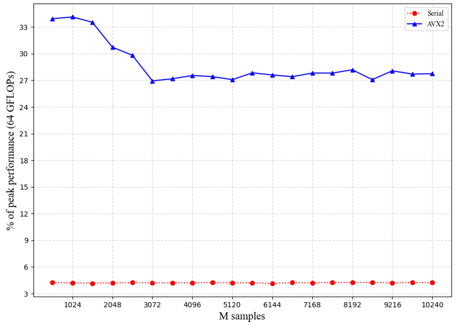
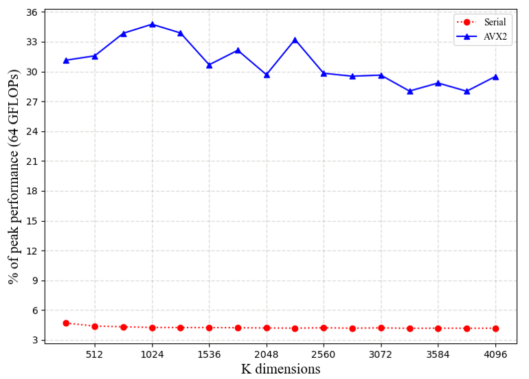

# HPC-on-matrix:
The purpose of this project is to show how high performance computing, which is also perceived as parallel computing, distributed computing or heterogeneous computing, could accelerate very common algorithms in nowadays Artificial Intelligence. Contains matrix euclidean distance, matrix multiplying, 2D convolution computing, and 3D Stencil computing.

## Matrix GEmm-based Euclidean Distance
* Environment
  * Windows 10
  * VS2022 Release x64
  * AMD Ryzen 3500x (~4.0GHz, L1c = 64 KB, disable multiprocessing)
  * DDR4 16G 3000MHz
* Implemented GED:
 
  |  Methods        |    CHUNK     |     SSE/AVX    |   Time(ms)      |       Validation   |      speed-up|  % of peak performance
  |-----------------|:-------------:|:-------------:|:--------------:|:--------------------:|:-----------:|:----------:|
  |CPU serial:  |              |                 |      20.29  |        pass   |        1x  |  4.22  |
  |CPU chunk-avx: |   ✔   |  ✔             |       2.51   |         pass   |     8.09x  |  34.14  |
  
* General settings:  
  * Size of Matrix1: (M, K)=(1024, 1024), Matrix2: (K, N)=(1024, 25)  

* Percent of peak performance on different M
 

* Percent of peak performance on different K
 

## Matrix Multiply
* General Matrix Multiply:  
  * CPU Entrance: general_matrix_multiply/general_matrix_multiply/  
  * GPU Entrance: GeneralMatrixMultiply_GPN/GeneralMatrixMultiply_GPN/
* Environment:  
  * Windows 10  
  * VS2017 Release x64 (disable all auto-optimization)
  * Intel Core i7 4720HQ (4 cores, 8 threads, L1c = 32 KB, L3c = 6144 KB)  
  * DDR3L 8G 1600MHz 
  * Geforce GTX 960M, 640 cu
* Implemented Matrix Multiply(MM):  

  |  Methods        |   OpenMP    |   CHUNK     |     SSE/AVX    | CUDA |NEON|   Time(ms)      |       Validation   |      speed-up|  % of peak performance
  |-----------------|:-------------:|:-------------:|:--------------:|:--:|:----------------:|:--------------:|:--------------------:|:-----------:|:----------:|
  |CPU serial:      |       |    |     |     |  |  10757.1  |    pass   |        1x  | |
  |CPU chunk-serial:   |    |  ✔   |    |  ||   4464.14   |   pass   |     2.41x  |
  |CPU omp:        |     ✔  |     |   |  |     |   2307.25  |    pass  |      4.66x   ||
  |CPU chunk-omp:    |   ✔    |  ✔   |   |        ||    1487.28  |    pass  |     7.23x  | |
  |CPU chunk-avx:    |      | ✔   |   ✔  |       ||    978.398   |   pass   |    10.99x  | |
  |CPU chunk-avx-omp:  | ✔   |   ✔   |   ✔ |  ||    270.828 |    pass  |     39.72x  | |
  |GPU AB:         |          |      |           |     ✔      | |32.91 | pass | 326.86x ||
  |GPU ABT:         |          |      |            |     ✔      | |166.89 | pass | 64.46x ||
  |GPU ATB:         |          |      |            |     ✔      | |31.74 | pass | 338.91x ||
  |GPU AB (shared memory):         |               |      |      |     ✔    |   |20.80 | pass | 517.17x ||
  |ARM A15 (L1 Cache Tiling):         |               |    ✔    |      |         |   ✔  | | pass ||70.56|

* General settings:  
  
  * Size of Matrix1 \* Matrix2: (1024, 1024) \* (1024, 1024)  
  * Chunk size: 64\*64 elements  
  * OMP threads: 8  
  * AVX SIMD parallel: 8\*float(32 bits)  
  * AVX parallel in chunk: 2 rows (depends on how many AVX registers on the machine)  
  * CUDA: Block(32, 32)
## 3D Stencil computing
* General Matrix Multiply:  
  * CPU/GPU Entrance: Stencil/Stencil/
  
* Environment:  
  * Windows 10  
  * VS2017 Release x64 (disable all auto-optimization)
  * Intel Core i7 4720HQ (4 cores, 8 threads, L3c = 6144 KB)  
  * DDR3L 8G 1600MHz 
  * Geforce GTX 960M, 640 cu
  
* Implemented 3D Stencil computing:  

|  Methods          |   OpenMP        |   CUDA      | Time(ms)         |       Validation |      speed-up  | 
|-----------------  |:---------------:|:-----------:|:----------------:|:----------------:|:--------------:|
|CPU serial:        |                 |             |11352            |  pass            | 1x             | 
|GPU:               |                 |     ✔       |70.47            |  pass            | 161.09x             |

* General settings:  
  
  * Size of Tensor: (512, 512, 512)
  * Stencil radius: 6  
  * Kernel size: 13  
  * CUDA: Block(32, 32)
* Reference:

  * [3D Finite Difference Computation on GPUs using CUDA, Paulius Micikevicius, NVIDIA](https://developer.download.nvidia.com/CUDA/CUDA_Zone/papers/gpu_3dfd_rev.pdf)

* X86 CPU's dilemma:

   * 3D Stencil requires accessing data on three dimensions consecutively, however, the cache on X86 is one dimensional. Let's see what happens when doing 3D tiling on L1 cache. Given that X86's L1 cache size is 32KB, 8 * 1024 32-bit-float values could be stored. If using 3D cublic tiling, the length of each dimension is 16. Then, we do 3D tiling again on L2 cache. Given that X86's L2 cache size is 256KB, if using 3D cublic tiling, the length of each dimension is 32. Here comes that problem --- the length of cache line on X86 is 64 Bytes, therefore hardware pre-fetching cannot be used properly, which may even cause negative effects on performance. 
 
   * Considering cache tiling, no matter doing it on L1 or L2, the tile size will be too small to exploit the capacity of X86 cache hierarchy, which is why in any 3D Stencil implementation on X86 will always be limited by L3 cache and RAM's performance.
   
   * This problem will happen again on NVIDIA GPU if trying to store 3D data on shared memory. A way to solve it is on above reference, and my code shows exactly how to do.

## 2D Convolution
* 2D Convolution:  
  * CPU Entrance: 2D_Convolution/2D_Convolution/
  * GPU Entrance: 2D_Convolution_GPU/2D_Convolution_GPU/
* Environment:  
  * Windows 10  
  * VS2017 Release x64 (disable all auto-optimization)
  * Intel Core i7 4720HQ (4 cores, 8 threads, L3c = 6144 KB)  
  * DDR3L 8G 1600MHz 
  * Geforce GTX 960M, 640 cu
  
* Implemented 2D Convolution:  

  |  Methods        |   OpenMP    |   CHUNK     |     SSE/AVX    | CUDA |NEON|   Time(ms)      |       Validation   |      speed-up|  % of peak performance
  |-----------------|:-------------:|:-------------:|:--------------:|:--:|:----------------:|:--------------:|:--------------------:|:-----------:|:----------:|
  |CPU serial:      |       |    |     |     |  |  1459.82  |    pass   |        1x  | |
  |CPU serial-loop-unroll:   |    |     |    |  ||   1218.51   |   pass   |     1.2x  |
  |CPU avx:        |     ✔  |     |   |  |     |   327.698  |    pass  |      4.45x   ||
  |CPU chunk-avx:    |      |  ✔   |  ✔  |        ||    284.75  |    pass  |     5.13x  | |
  |CPU omp-avx:    |   ✔    |   |   ✔  |       ||    89.729   |   pass   |    16.27x  | |
  |GPU:         |          |      |           |     ✔      | |86.954 | pass | 16.79x ||
  |GPU constant_kernel:         |          |      |            |     ✔      | |77.04 | pass | 18.95x ||
  |GPU constant_kernel_Tiling:         |               |      |      |     ✔    |   |74.927 | pass | 19.48x ||
  |ARM A15:         |               |        |      |         |   ✔  | | pass ||4.2GFlops|

* General settings:  
  
  * Size of Matrix: (4096, 4096)
  * Size of Kernel: 5 x 5 
  * CUDA: Block(32, 32)
